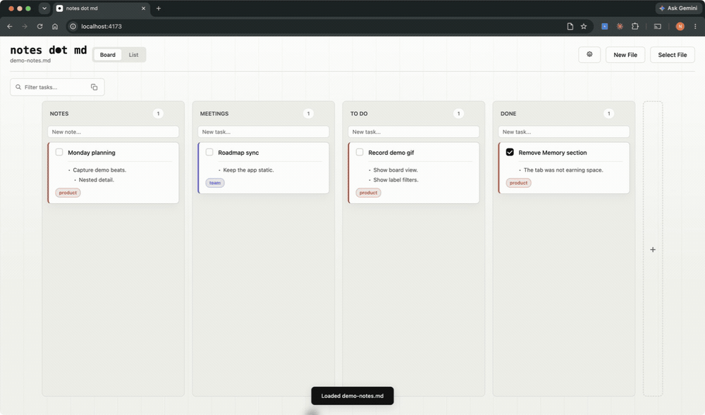

# `notes d●t md`

A static, local-first markdown dashboard for meeting notes, tasks and to-do's.

`notes d●t md` offers robust note-taking and task tracking organized around "initiatives" and "topics". It stores your notes in a single `.md` file with no login, sync, or database.

Use the app on any device; keep your notes local to that device. 

## Demo

TODO: Add a link to the live hosted app.

## Features

- **Low friction:** Every meeting, task, and thought begins as a card in the same workspace. There is nothing to name, locate, or organize before you start writing.

- **Focus on initiatives:** Narrow the workspace by initiative or search result. See notes, decisions, and open tasks together so you can understand where things stand and what moves them forward.

- **Portable context:** Copy the filtered cards as structured markdown, including dates and metadata. Bring the relevant context into an LLM without sorting through or sharing the rest of your notes.

- **Low maintenance:** No folders, directories, or knowledge-management system to maintain. The structure builds from the information attached to each card as you work.

## Limitations

Requires a Chromium-based browser with File System Access API support. This project has been tested with and is recommended to be used on Chrome.
